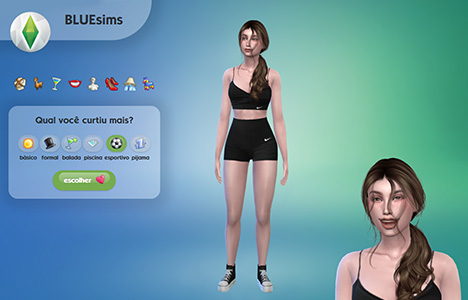

Essa página está em  Português.
To view this page in  English, [click here](./README.md).

---

# 🪅 BLUEsims

Inspirado no jogo The Sims, você ajudará a belíssima Henrietta a escolher seu visual e, assim, decidir o que ela fará hoje.

## 🔗 Demo

- [bluesims.camilasalles.dev](https://bluesims.camilasalles.dev/)

## ℹ️ Informações Gerais

Exercício proposto:

> _Neste exercício, você deve criar uma página web simples com HTML e usar JavaScript para praticar a manipulação do DOM. Comece criando uma página HTML com uma imagem, um texto e um botão. Depois, adicione um event listener ao botão para detectar cliques. Quando o botão for clicado, você deve alterar a imagem, o texto do parágrafo e a cor de fundo/imagem. Para um desafio extra, faça com que os elementos voltem ao estado original quando o botão for clicado novamente. Utilize [esta página](https://blue-edtech.github.io/Codelab/jogo-do-humor/index.html) como exemplo._

## 🧮 Tecnologias

- HTML
- CSS
- JavaScript

## 💎 Features

- Animações em CSS
- Layout responsivo
- Tipografia customizada
- Imagens customizadas

## 🖼️ Screenshots

## 👩‍💻 Autoria

- [@miaslls](https://www.github.com/miaslls)

## 🫶 Recursos / Agradecimentos

- [The Sims 4](https://www.ea.com/games/the-sims/the-sims-4)
- [The Sims 4 Ultimate Game Icon Pack](https://modthesims.info/d/549037/the-sims-4-ultimate-game-icon-pack.html)
