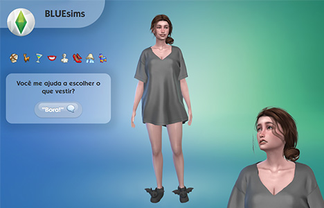
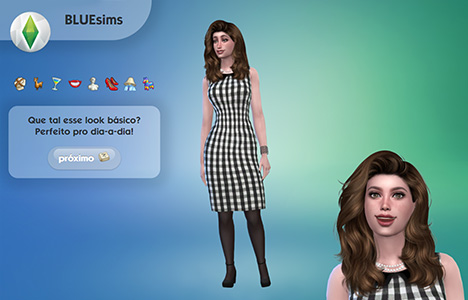
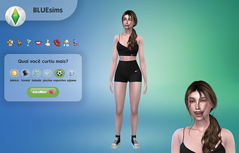

This page is in  English.
Para visualizar essa página em  Português, [clique aqui](./README-ptbr.md).

---

# 🪅 BLUEsims

Inspired by The Sims, you'll assist the stylish Henrietta choose her outfit and influence her day.

## 🔗 Demo

- [GitHub Pages](https://miaslls.github.io/BLUEsims/)

## ℹ️ General Info

Proposed exercise:

> _In this exercise, you should create a simple web page using HTML and use JavaScript to practice DOM manipulation. Start by creating an HTML page with an image, text, and a button. Next, add an event listener to the button to detect clicks. When the button is clicked, you should change the image, the paragraph text, and the background color/image. For an extra challenge, make the elements return to their original state when the button is clicked again. Use [this page](https://blue-edtech.github.io/Codelab/jogo-do-humor/index.html) as an example._

## 🧮 Technologies

- HTML
- CSS
- JavaScript

## 💎 Features

- CSS animations
- Responsive layout
- Custom typography
- Custom images

## 🖼️ Screenshots

## 👩‍💻 Authors

- [@miaslls](https://www.github.com/miaslls)

## 🫶 Acknowledgements

- [The Sims 4](https://www.ea.com/games/the-sims/the-sims-4)
- [The Sims 4 Ultimate Game Icon Pack](https://modthesims.info/d/549037/the-sims-4-ultimate-game-icon-pack.html)
